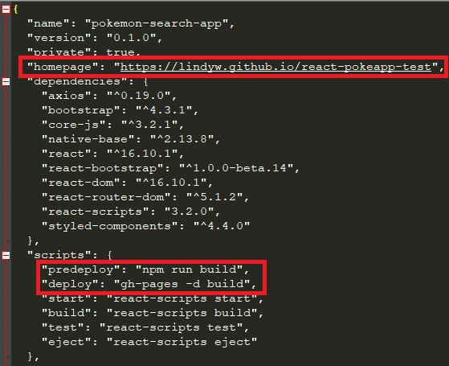

# PokeApp written in ReactJS (v16.10.1) by Woon Him (Lindy) Wong
**PokeApp webapp is lively running here:** https://lindyw.github.io/react-pokeapp-test/

## 1. How to run this webapp in localhost?

1. Open your Command Prompt.

2. Change the current working directory to the location where you want the cloned directory to be made. (i.e. cd {path})

3. Type `git clone https://github.com/lindyw/react-pokeapp-test.git`

4. Now `cd {your local clone path}` and type:

### `npm start`

Runs the app in the development mode. 
Open [http://localhost:3000](http://localhost:3000) to view it in the browser.

The page will reload if you make edits. 
You will also see any lint errors in the console.

## 2. How to deploy this webapp (in GitHub Pages)?

### Prerequisites:

  - GitHub Account.
  - Install Git in your machine and set up Git.
  - Make sure you have install [Node.js] and [Npm] in your machine.
  - *We need to install GitHub Pages package as a dev-dependency.
	
	type `cd {cloned local repository path}`
	
		 `npm install gh-pages --save-dev`
	
	P.S. Once installed gh-pages, I recommand you to restart the Command Prompt again for the following step. 
	
  
### Procedure:

1. Add properties to `package.json` file.
   - Add `"homepage": "https://{username}.github.io/{repo-name}"`
   - Add `"predeploy": "npm run build",
		  "deploy": "gh-pages -d build"` under `scripts` property
   - Save `package.json`.
   
   
   
2. Create a Github repository and initalize it and add it as a remote in your local cloned git repository.
	
	open up yor Command Prompt and type,
	- `git init`
	- add it as remote `git remote add origin [repository url]`

3. Now you can deploy it to GitHub Pages!
   
   just run the follow command:
   `npm run deploy`
   
 Enjoy!
 
 ### github pages - Official Documentations
 
 https://create-react-app.dev/docs/deployment

  

